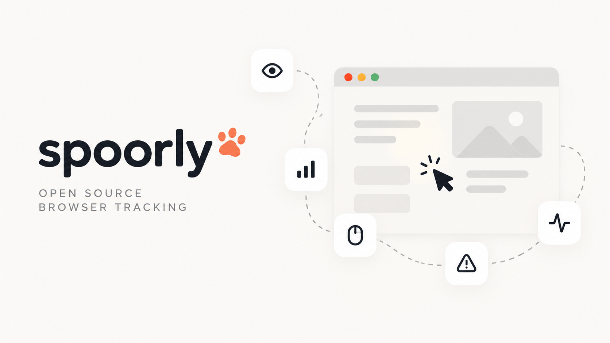

<p align="center">
  
</p>

<p align="center">
  <a href="https://www.npmjs.com/package/spoorly"></a>
  <a href="https://www.npmjs.com/package/spoorly"></a>
  <a href="https://bundlephobia.com/package/spoorly"></a>
  <a href="https://github.com/nacorga/spoorly/actions/workflows/ci.yml"></a>
  <a href="./LICENSE"></a>
</p>

Vendor-neutral browser autocapture: clicks, scroll, web vitals, errors, sessions and page views, sent to your own endpoint or forwarded to any analytics tool.

*Spoor* (noun): the track or trail an animal leaves behind.

## Why

- **Autocapture out of the box.** Clicks, scroll depth, Core Web Vitals, JavaScript errors, sessions and page views (including SPA route changes) with no instrumentation code.
- **One runtime dependency.** Only [`web-vitals`](https://github.com/GoogleChrome/web-vitals).
- **Delivery you can rely on.** Batching, retries with backoff, `localStorage` persistence and recovery, and `sendBeacon` on page hide and unload.
- **No vendor.** Point it at your own endpoint, or consume events in the page with `on('event')` and forward them wherever you like.
- **Small.** 27.44 kB gzipped (IIFE bundle, `npm run size`).

## Install in one line

```html
<script
  src="https://cdn.jsdelivr.net/npm/spoorly@0.2.1/dist/browser/spoorly.js"
  data-endpoint="https://api.example.com/collect"
  integrity="sha384-lG4eR8BTLp5G6dlHLVaWQN2JiD4VFCi+leanrgBd7LzFYrFDBLyBTlJ6M3VZUICq"
  crossorigin="anonymous"
></script>
```

When the script tag carries `data-endpoint`, the bundle calls `spoorly.init({ endpoint })` as soon as it is evaluated (classic `async` and `defer` work too). Without the attribute it only exposes `window.spoorly` and you call `init()` yourself. If the autoinit fails (for example an invalid endpoint), the error is reported once with `console.error`.

The hash above is for `0.2.1`. For another version, get it from jsDelivr or compute it:

```bash
curl -s https://cdn.jsdelivr.net/npm/spoorly@0.2.1/dist/browser/spoorly.js | openssl dgst -sha384 -binary | openssl base64 -A
```

Pin an exact version (`spoorly@0.2.1`) when you use `integrity`, because the hash changes with every release.

The autoinit only exists in the IIFE bundle (`dist/browser/spoorly.js`). The ES module bundle (`dist/browser/spoorly.esm.js`) and the npm package never initialize on their own. Autoinit runs `init()` before your own code can call `on()`, so a listener added afterwards misses the initial `session_start` and `page_view`. When you consume events in the page, use a manual `init()` instead (see [Recipes](#recipes)).

## npm

```bash
npm i spoorly
```

```ts
import { spoorly } from 'spoorly';

// Standalone: no network requests. Events are only emitted locally.
spoorly.on('event', (event) => console.log(event.type, event));
await spoorly.init();

// With an endpoint: events are batched and POSTed to your receiver.
await spoorly.init({ endpoint: 'https://api.example.com/collect' });

spoorly.event('signup_started', { plan: 'pro' });
```

`endpoint` must be `https:`. Plain `http:` is accepted only for `localhost`, `127.0.0.1` and `[::1]`; anything else makes `init()` reject. Local listeners registered with `on()` receive every event in both modes.

The full API (every `Config` option, `identify`, `resetIdentity`, critical events, SPA notes) is in [API_REFERENCE.md](./API_REFERENCE.md).

## Payload contract

Every request is a `POST` whose body is one JSON-serialized `EventsQueue` batch. A real batch, captured from a browser session:

```json
{
  "user_id": "cf566a9f-08e1-4a75-a3b9-038e9a3b63cc",
  "session_id": "1790944588283-sztv8mgop",
  "device": { "type": "desktop", "os": "macOS", "browser": "HeadlessChrome" },
  "events": [
    {
      "id": "1790944588284-000-aae1d6",
      "type": "session_start",
      "page_url": "http://localhost:3456/pricing?utm_source=newsletter&utm_medium=email",
      "timestamp": 1790944588284,
      "referrer": "Direct",
      "utm": { "source": "newsletter", "medium": "email" }
    },
    {
      "id": "1790944588285-000-eb28bf",
      "type": "page_view",
      "page_url": "http://localhost:3456/pricing?utm_source=newsletter&utm_medium=email",
      "timestamp": 1790944588285,
      "referrer": "Direct",
      "page_view": { "title": "Pricing" },
      "utm": { "source": "newsletter", "medium": "email" }
    },
    {
      "id": "1790944589151-000-6093e3",
      "type": "click",
      "page_url": "http://localhost:3456/pricing?utm_source=newsletter&utm_medium=email",
      "timestamp": 1790944589151,
      "referrer": "Direct",
      "click_data": {
        "x": 52,
        "y": 17,
        "tag": "a",
        "id": "cta",
        "class": "btn primary",
        "text": "Start free trial",
        "href": "/signup?plan=pro"
      },
      "utm": { "source": "newsletter", "medium": "email" }
    },
    {
      "id": "1790944589463-000-660238",
      "type": "scroll",
      "page_url": "http://localhost:3456/pricing?utm_source=newsletter&utm_medium=email",
      "timestamp": 1790944589463,
      "referrer": "Direct",
      "scroll_data": { "depth": 81, "direction": "down", "container_selector": "window" },
      "utm": { "source": "newsletter", "medium": "email" }
    },
    {
      "id": "1790944590380-000-07cd57",
      "type": "custom",
      "page_url": "http://localhost:3456/pricing?utm_source=newsletter&utm_medium=email",
      "timestamp": 1790944590380,
      "referrer": "Direct",
      "custom_event": { "name": "signup_started", "metadata": { "plan": "pro" } },
      "utm": { "source": "newsletter", "medium": "email" }
    }
  ],
  "global_metadata": {},
  "_metadata": {
    "idempotency_token": "310cc104",
    "referer": "http://localhost:3456/pricing?utm_source=newsletter&utm_medium=email",
    "timestamp": 1790944598290,
    "client_version": "0.2.1"
  }
}
```

- **Shape.** `user_id`, `session_id`, `device`, `events[]`, plus optional `global_metadata` (from `Config.globalMetadata`), `identify` (from `identify()`, sent with every batch) and `_metadata`. Each event has `id`, `type`, `page_url`, `timestamp` and one type-specific block: `page_view`, `click_data`, `scroll_data`, `custom_event`, `web_vitals` or `error_data`. `referrer`, `utm` and `click_ids` describe how the session started. The event types are `page_view`, `click`, `scroll`, `session_start`, `custom`, `web_vitals` and `error`; [API_REFERENCE.md](./API_REFERENCE.md#event-types) documents every field.
- **Types.** `import type { EventsQueue, EventData } from 'spoorly'`. All event and payload types are exported.
- **Encoding.** `fetch` sends `Content-Type: text/plain;charset=UTF-8` with `credentials: 'omit'`; `sendBeacon` sends a `text/plain;charset=UTF-8` Blob. The body is JSON: parse it yourself. A `text/plain` request needs no CORS preflight.
- **Response.** Any 2xx is success; the body is ignored.
- **Version.** `_metadata.client_version` is the library version that built the batch.

Retries and persistence:

| Response | Retries | Persistence |
| --- | --- | --- |
| 2xx | None | Persisted copy cleared |
| 4xx except 408 and 429 | None | Discarded |
| 408, 5xx, network error, request timeout (15 s) | Up to 2, exponential backoff with jitter (200–300 ms, then 400–500 ms) | Persisted after the last attempt |
| 429 | None. Arms a 60 s cooldown, mirrored to `localStorage` and shared by every tab on the origin | Persisted immediately |
| `sendBeacon` rejected, unavailable or payload over 64 KB | None | Persisted immediately |

Persisted batches live in `localStorage` and are resent on the next `init()` and when the page is restored from the back/forward cache. A persisted batch older than 2 hours is dropped, and so is one that has failed recovery 3 times. After 3 consecutive network-level failures (DNS, connection refused) the sender stops trying for 2 minutes, then lets one probe batch through.

Delivery guarantees:

- **At-least-once.** Retries, recovery from `localStorage` and a beacon racing an in-flight fetch can deliver the same event more than once. Deduplicate by `event.id`, or per batch by `_metadata.idempotency_token` (a hash of the batch's event ids, stable across retries).
- **No ordering.** A batch recovered from an earlier visit can arrive after a newer one. Order by each event's `timestamp`.

## Writing a receiver

The repo ships a dependency-free reference receiver:

```bash
node examples/receiver/server.mjs   # http://localhost:8787/collect (PORT overrides the port)
```

It answers every request with `Access-Control-Allow-Origin: *`, parses the body, drops events whose `id` it has already seen, logs the rest and replies `204`. A body that isn't JSON with an `events` array gets `400`; a body over about 1 MB gets `413`. Its `GET /received` route is a test hook for the e2e suite; drop it in a real receiver.

- **Express.** `express.json()` ignores `text/plain`, so read the raw text and parse it yourself:

  ```js
  app.post('/collect', express.text({ type: '*/*', limit: '1mb' }), (req, res) => {
    const batch = JSON.parse(req.body);
    // store batch.events, deduplicating by event.id
    res.sendStatus(204);
  });
  ```

- **CORS.** Requests carry no credentials and no custom headers, so `Access-Control-Allow-Origin: *` is all you need.
- **Authentication.** Custom headers are not supported (`sendBeacon` cannot send them). If your receiver needs a write key, put it in the query string: `endpoint: 'https://api.example.com/collect?key=…'`.

## Recipes

These recipes use a manual `init()` with `on()` registered first, so the listener also receives the `session_start` and `page_view` fired during `init()`.

### Your endpoint

```ts
import { spoorly } from 'spoorly';

await spoorly.init({ endpoint: 'https://api.example.com/collect' });
```

### GA4

```ts
import { spoorly } from 'spoorly';

spoorly.on('event', (event) => {
  if (event.type === 'custom' && event.custom_event) {
    const { metadata } = event.custom_event;
    gtag('event', event.custom_event.name, Array.isArray(metadata) ? { items: metadata } : { ...metadata });
  } else if (event.type === 'click' && event.click_data) {
    gtag('event', 'spoorly_click', { tag: event.click_data.tag, text: event.click_data.text });
  } else if (event.type === 'scroll' && event.scroll_data) {
    gtag('event', 'spoorly_scroll', { depth: event.scroll_data.depth });
  }
});

await spoorly.init();
```

### PostHog

```ts
import { spoorly } from 'spoorly';

spoorly.on('event', (event) => {
  posthog.capture(`spoorly_${event.type}`, { ...event });
});

await spoorly.init();
```

Use `init()` without `endpoint` when the listener is the only destination, or pass both to send to your receiver as well.

## Consent

spoorly ships no consent banner. Don't call `init()` until the visitor has consented. Before `init()` nothing is captured, and nothing is stored unless you call `identify()`. When consent is withdrawn, call `spoorly.destroy()`, which stops tracking, sends what is already queued and removes every listener.

What the library stores, all under keys starting with `spoorly:`:

| Storage | Key | Contents |
| --- | --- | --- |
| `localStorage` | `spoorly:uid` | Random visitor UUID |
| `localStorage` | `spoorly:session` | Current session id, last activity time, and the referrer, UTM and ad click ids the session started with |
| `localStorage` | `spoorly:identity`, `spoorly:pending_identity` | Data passed to `identify()` |
| `localStorage` | `spoorly:{userId}:queue` | Batch waiting to be resent after a failed send |
| `localStorage` | `spoorly:{userId}:rate_limit` | End of a 429 cooldown |
| `localStorage` | `spoorly:{userId}:session_counts:{sessionId}`, `spoorly:session_counts_last_cleanup` | Per-session event counters (expire after 7 days) |
| `sessionStorage` | `spoorly:session` | Mirror of the session, so it survives an external redirect |
| `sessionStorage` | `spoorly:qa_mode` | QA mode flag |

To remove everything after `destroy()`, delete the keys that start with `spoorly:` from both storages. To keep the library from initializing at all, set `window.__spoorlyDisabled = true` before `init()` runs.

## Privacy

- **`data-spoorly-ignore`.** Clicks on an element with this attribute, or inside one, are not captured.

  ```html
  <div data-spoorly-ignore>
    <button>Delete account</button>
  </div>
  ```

- **`sensitiveQueryParams`.** Query parameters are removed from `page_url`, click `href`, referrers and `_metadata.referer` before anything is emitted. The default list is `token`, `auth`, `key`, `session`, `sessionid`, `session_id`, `jwt`, `bearer`, `oauth`, `reset`, `password`, `api_key`, `apikey`, `secret`, `access_token`, `refresh_token`, `verification`, `code` and `otp`; `sensitiveQueryParams` adds to it.
- **Click PII scrubbing.** Click `text`, `id` and `class` are scrubbed for emails, phone numbers, card numbers, IBANs, `sk_`/`pk_` API keys, bearer tokens, connection-string passwords and sensitive query parameters, each replaced with `[REDACTED]`. Error messages and stack traces get the same treatment. Click text is capped at 255 characters. Form field values are never read: a click on an `<input>`, `<textarea>` or `<select>` reports the element without any text, and form controls inside a clicked element are left out of its text.
- **Your data.** Metadata you pass to `event()`, `identify()` and `globalMetadata` is sent as is. Keep PII out of it.

More detail in [SECURITY.md](./SECURITY.md).

## Playground

Try it live at **[nacorga.github.io/spoorly](https://nacorga.github.io/spoorly/)**: a small demo store with a live event monitor. Run it locally with `npm run docs:dev`.

## License

[MIT](./LICENSE) © 2026 Ignacio Cortés García
